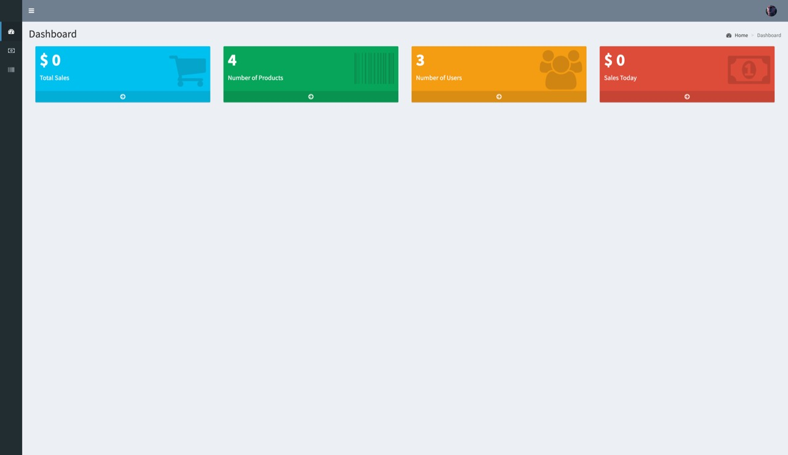

<h1 align='center'>Retail Manager</h1>
<h2>About</h2>
A retail manager is someone who is responsible for the management of a retail store. They are responsible for every aspect of the day-to-day supervision of sales, staff, and stock.

<h2>Home Page</h2>
* Google Maps API integration 
* Choose nearby stores (radius in kms) 
* Shows trending products in nearby locality 
* Multiple categories can be chosen 
<h1 align='center'></h1><h1 align='center'></h1>  
<h2>Admin</h2>  
<h3>Sign up:</h3>
* Enter the Firstname of the member  
* Enter Lastname of member  
* Enter the valid email Id  
* Enter the Password and verify it by retype  
* Click the check box and verify you are not a robot  
* Then enter sign up button  
<h1 align='center'></h1>  
<h3>Login</h3>  
* Enter the registered email id 
* Enter the password 
* Press Sign In for further process 

<h1 align='center'></h1>
<h3>Dashboard</h3>
* Total number of sales is shown 
* Number of details is shown 
* Number of Users is shown 
* Total number of sales for today is shown 
<h1 align='center'></h1>
<h3>Category</h3>
* Number of entries for particular Category 
* Search for the required Category 
* Category names along with edit and delete tools is shown 
<h1 align='center'></h1>
<h3>Product List</h3>
* Product Name 
* Price  
* Photo  
* No of quantity 
<h1 align='center'></h1>
<h2> Clonning the Repo</h2> 

    git clone https://github.com/pushpeshkamal/retail_manager.git
    
<h2>Procedure</h2>
1. Download XAMPP  
2. clone in xampp/htdocs/  
3. Launch Apache Server, my sql server and ProFTPD  
4. Open a browser and go to URL http://localhost/phpmyadmin  
5. Create a database naming “ecomm” and then click on the import tab  
6. Click on go  
7. open index.php  
<h2>Contributors</h2>  
* Pushpesh Kamal   
* Aditya Mishra 
* Umang Shringi
